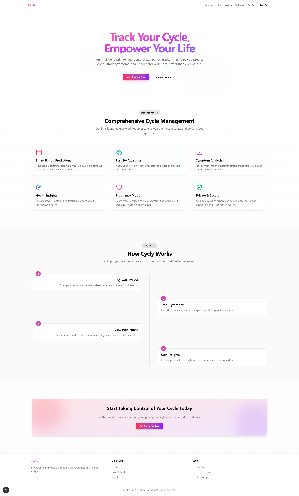

# Period Tracker & Fertility App

A modern, comprehensive period tracking and fertility monitoring application built with Next.js and Supabase.



## Features

### Period & Fertility Tracking
- Record period start and end dates with flow intensity
- Visual calendar with period, fertility, and ovulation indicators
- Automatically calculate average cycle length
- Predict upcoming periods and fertility windows
- Advanced cycle visualization with phase information

### Symptom Tracking
- Log physical and emotional symptoms with severity levels
- Track patterns throughout your cycle
- Add notes for personalized tracking
- View symptom history and trends

### Pregnancy Mode
- Switch to pregnancy tracking when applicable
- Calculate due date and pregnancy progression
- Week-by-week development information
- Track pregnancy milestones and checkpoints

### Health Insights & Education
- Access educational content about reproductive health
- Get personalized insights based on your cycle data
- View helpful articles about menstrual health, fertility, and wellness

## Technology Stack

- **Frontend**: Next.js 14 with TypeScript and React
- **UI Components**: Tailwind CSS with Shadcn UI
- **Backend**: Supabase (PostgreSQL)
- **Authentication**: NextAuth.js with Google OAuth and email/password
- **Data Visualization**: Custom React components
- **Date Handling**: date-fns
- **Form Handling**: React Hook Form with Zod validation

## Getting Started

### Prerequisites
- Node.js 18+ and npm/yarn
- Supabase account (for backend)

### Installation

1. Clone the repository
```bash
git clone https://github.com/yourusername/period-tracker.git
cd period-tracker
```

2. Install dependencies
```bash
npm install
# or
yarn install
```

3. Set up environment variables by creating a `.env.local` file:
```
NEXT_PUBLIC_SUPABASE_URL=your_supabase_url
NEXT_PUBLIC_SUPABASE_ANON_KEY=your_supabase_anon_key
NEXTAUTH_SECRET=your_nextauth_secret
NEXTAUTH_URL=http://localhost:3000
GOOGLE_CLIENT_ID=your_google_client_id
GOOGLE_CLIENT_SECRET=your_google_client_secret
```

4. Run the database schema migration (found in `supabase/schema.sql`)

5. Start the development server
```bash
npm run dev
# or
yarn dev
```

6. Open [http://localhost:3000](http://localhost:3000) in your browser

## Key Components

### Enhanced Calendar
The application features a specialized calendar component that visualizes your cycle:
- Color-coded days for period, fertility, and ovulation
- Tooltips with detailed information
- Phase tracking with descriptive information
- Cycle progress indicators

### Period Logging
Intuitive interface for recording menstrual cycles:
- Start and end date selection
- Flow intensity tracking
- Historical data viewing

### Symptom Tracking
Comprehensive symptom logging with:
- Common symptom presets 
- Severity levels
- Optional notes
- Date-based organization

### Pregnancy Mode
Specialized interface for pregnancy tracking:
- Due date calculation
- Week-by-week progress
- Development milestones
- Health tracking

## Security

- Row-Level Security (RLS) policies ensure users only access their own data
- NextAuth.js for secure authentication
- HTTPS enforced in production
- No sensitive data stored in client-side state

## Contributing

Contributions are welcome! Please feel free to submit a Pull Request.

1. Fork the repository
2. Create your feature branch (`git checkout -b feature/amazing-feature`)
3. Commit your changes (`git commit -m 'Add some amazing feature'`)
4. Push to the branch (`git push origin feature/amazing-feature`)
5. Open a Pull Request

## License

This project is licensed under the MIT License - see the LICENSE file for details.

## Acknowledgments

- Design inspired by modern health tracking applications
- Icons from Lucide Icons
- UI components based on Shadcn UI
